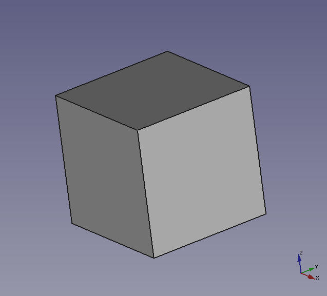

# A primer on OpenCascade for C++

## Introduction

This is an unofficial repository that aims to provide a primer on how to install the [OpenCascade](https://www.opencascade.com/doc/occt-7.4.0/overview/html/index.html) library and use it from your C++ projects to generate geometric CAD models.

OpenCascade is a powerful open-source geometric CAD kernel written in C++ that offers most of the functionality available in modern CAD software. However, starting to use OpenCascade for geometric design can be a dauting task for newcomers because:

- The installation process is involved, at least compared to that of most commercial software. 
- It does not provide a graphical user interface (GUI) where one can drag components to generate geometric models. Instead, the models are generated by means of C++ projects and then exported in a suitable format (.step, .iges, etc) that can be visualized in an external GUI.
- The OpenCascade library is a large project with hundreds of classes and methods and it is not obvious how to start using it to start developing your own geometric models.

If you wanted to try out OpenCascade, but you were not sure about how to get started, this repository might be the right starting point for you!

 

        
        &emsp; &emsp; &emsp; &emsp; &emsp;
        

 

## Contents

The repository is organized as follows:

- [Detailed installation instructions](docs/open_cascade_installation.md) for Linux
- [A minimum working example](docs/open_cascade_minimum_working_example.md) to check if the installation was sucessful
- [A set of demonstration projects](open_cascade_demos/) showcasing some of the OpenCascade functionality
	

 

        

 

**We hope that this repository can be useful to OpenCascade newcomers!**

Roberto Agromayor, PhD candidate at NTNU

