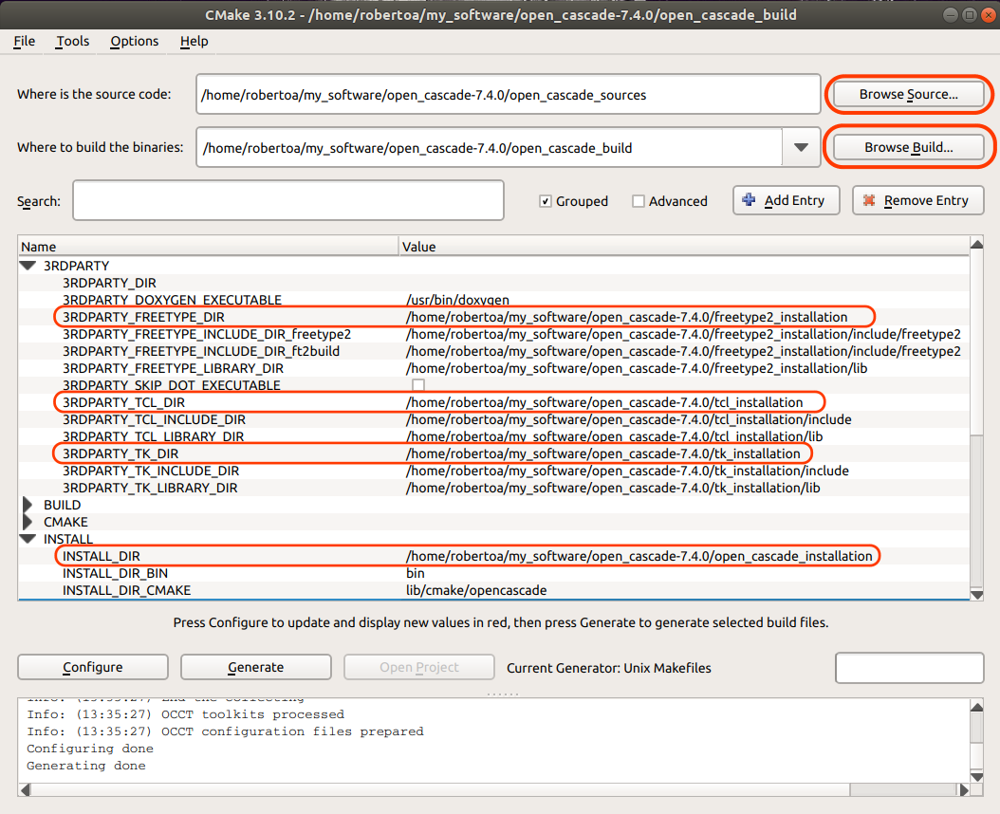

# Open Cascade installation

## 1. Introduction

This document provides a detailed explanation of how to install the OpenCascade library in Linux compiling the source files.
Although it is possible to install the software following the [official installation instructions](https://www.opencascade.com/doc/occt-7.4.0/overview/html/occt_dev_guides__building.html), we felt that it could be beneficial to prepare a more accessible description of the installation process for those without a strong programming language.

In addition, we felt that the official documentation was lacking a minimum working example that the user could run to make sure that the installation was successful.
For this reason we prepared a [simple C++ demonstration project](./open_cascade_minimum_working_example.md) that can be compiled to check that the installation process was successful and also to serve as a starting point for the user to developt their own CAD models using OpenCascade.

In this guide we assume that OpenCascade will be installed in the directory `${HOME}/my_software/open_cascade-7.4.0`, where `${HOME}`in an environmental variable pointing to the Home directory of your system.
To create the installation directory type:

	mkdir ${HOME}/my_software/open_cascade-7.4.0

For the rest of the instructions we will assume that we are working on the `open_cascade-7.4.0` directory unless we indicate so explicitly.

## 2. Installing the required third party

In order to compile OpenCascade we need to install three external libraries, namely: `Tcl`, `Tk`, and `FreeType2`.
The rest of this section explains how to install these libraries in a step by step manner.
You can also check the official instructions to install the third party libraries [here](https://www.opencascade.com/doc/occt-7.4.0/overview/html/occt_dev_guides__building_3rdparty_linux.html)

	
#### 2.1. Tcl installation

The Tcl library can be compiled using the [usual gnu triplet](https://www.howtogeek.com/105413/how-to-compile-and-install-from-source-on-ubuntu/):

> configure -> make -> make install

The detailed steps are as follows:

- First, create the directories `tcl_sources` and `tcl_installation` that will be used during the installation.

		 mkdir tcl_sources tcl_installation

- Download the Tcl library and extract the source files into the `tcl_sources` directory. Check which Tcl version should be downloaded in the [official OpenCascade site](https://www.opencascade.com/doc/occt-7.4.0/overview/html/occt_dev_guides__building_3rdparty_linux.html)

- Enter the `tcl_sources/unix` directory and run the gnu-triplet

		cd tcl_sources/unix
		./configure --enable-gcc  --enable-shared --enable-threads --prefix=${HOME}/my_software/open_cascade-7.4.0/tcl_installation
		make
		make install
	
You should replace the option `--prefix` with the correct path to the `tcl_installation` directory on your machine.
	
This may take a while. If the installation was successful you should be able to see that new directories poped-up in the `tcl_installation` directory.

#### 2.2. Tk installation

The Tk library can be compiled using the [usual gnu triplet](https://www.howtogeek.com/105413/how-to-compile-and-install-from-source-on-ubuntu/):

> configure -> make -> make install

The detailed steps are as follows:

- First, create the directories `tk_sources` and `tk_installation` that will be used during the installation.

		 mkdir tk_sources tk_installation

- Download the Tk library and extract the source files into the `tk_sources` directory. Check which Tk version should be downloaded in the [official OpenCascade site](https://www.opencascade.com/doc/occt-7.4.0/overview/html/occt_dev_guides__building_3rdparty_linux.html)

- Enter the `tk_sources/unix` directory and run the gnu-triplet

		cd tk_sources/unix
		./configure --enable-gcc  --enable-shared --enable-threads --with-tcl=${HOME}/my_software/open_cascade-7.4.0/tcl_sources/unix --prefix=${HOME}/my_software/open_cascade-7.4.0/tk_installation
		make
		make install
	
You should replace the option ` --with-tcl` with the correct path to the `tcl_sources/unix` directory and the option `--prefix` with the correct path to the `tk_installation` directory on your machine.
	
This may take a while. If the installation was successful you should be able to see that new directories poped-up in the `tk_installation` directory.

#### 2.3. FreeType2 installation

The FreeType2 library can be compiled using the [usual gnu triplet](https://www.howtogeek.com/105413/how-to-compile-and-install-from-source-on-ubuntu/):

> configure -> make -> make install

The detailed steps are as follows:

- First, create the directories `freetype2_sources` and `freetype2_installation` that will be used during the installation.

		 mkdir freetype2_sources freetype2_installation

- Download the FreeType2 library and extract the source files into the `freetype2_sources` directory. Check which FreeType version should be downloaded in the [official OpenCascade site](https://www.opencascade.com/doc/occt-7.4.0/overview/html/occt_dev_guides__building_3rdparty_linux.html)

- Enter the `freetype2_sources` directory and run the gnu-triplet

		cd freetype2_sources
		./configure  --prefix=${HOME}/my_software/open_cascade-7.4.0/freetype2_installation
		make
		make install
	
You should replace the option `--prefix` with the correct path to the `freetype2_installation` directory on your machine.
	
This may take a while. If the installation was successful you should be able to see that new directories poped-up in the `freetype2_installation` directory

## 3. OpenCascade installation

In this section we explain how to build the OpenCascade source files using CMake and the CMake graphical user interface (GUI).
You can also check the official instructions on how to build OpenCascade from the source files [here](https://www.opencascade.com/doc/occt-7.4.0/overview/html/occt_dev_guides__building_cmake.html)

#### 3.1. Installing CMake

From wikipedia:

> CMake is a cross-platform free and open-source software tool for managing the build process of software using a compiler-independent method.

In case you do not have CMake already installed in your system you can learn how to install it after a quick search on Google.
If you do that, you will soon find out that you can install CMake with this simple command:

	sudo apt-get install cmake
	
We will also use the CMake GUI to make the installation of OpenCascade more intuitive, we can install it by typing:

	sudo apt-get install cmake-qt-gui

#### 3.2. Compiling the source files

Now that we installed the required third party libraries and CMake we can compile the OpenCascade source files.

To do that we will set the configuration options using the CMake GUI and the build the library using the gnu-commands `make` and `make install`.  The detailed steps are as follows:

- First, create the directories `open_cascade_sources`, ` open_cascade_build` and ` open_cascade_installation`  that will be used during the installation.

	 	mkdir open_cascade_source open_cascade_build open_cascade_installation
		 

- Then download the OpenCascade source files from the [official side](https://www.opencascade.com/content/latest-release) and extract them into the `open_cascade_sources` directory.
The latest stable release by the time this manual was prepared was  `v7.4.0`

- Run `cmake-gui` to configure the build options. You have to set
	1. The path to the source code
	2. The path to the directory where to build the binaries

	and then press the `Configure` buttom. Once the configuration is complete, you will see a list of environmental variables that have to be speficied.	For a standard installation you only have to specify the paths to
	
	1. `INSTALL_DIR` should point to the `open_cascade_installation` directory
	2. `3RDPARTY_FREETYPE_DIR` should point to the `freetype2_installation` directory
	3. `3RDPARTY_TCL_DIR` should point to the `tcl_installation` directory
	4. `3RDPARTY_TKDIR` should point to the `tk_installation` directory

	Once that these environmental variables are set you can press the`Generate` buttom. The CMake GUI should look something like this after the configuration and generation:

-  Go to the `open_cascade_build` directory and run the `make` and `make install` commands to complete the installation:
		
		cd open_cascade_build
		make
		make install
		
	Observations:
	
	- You can speed up the process by running `make install` in parallel with all the processors of your computer.
	 To do this replace the `make` command by:
	
			make -j $(nproc)
	
	You can also exclude one processor to have some avilable resources to work on your computer if desired:
	
		make -j$(nproc --ignore=2)
		
	- You may encounter several errors during the `make` execution. Most of them will be because you lack some files or utilities in you computer. If this happens, read the error message and try to look for answers in Google, you will manage to solve the errors!
		
	- If `make install` fails due to lack of permissions try:
		
			sudo make install

The compilation may take quite a while, ejoy a cup of coffee. If the installation is successful you should be able to see that new directories poped-up in the `open_cascade_installation` directory.

To check that OpenCascade is running on your system you can try to compile and execute the [minimum working example](./open_cascade_minimum_working_example.md) provided in this repository.

 
