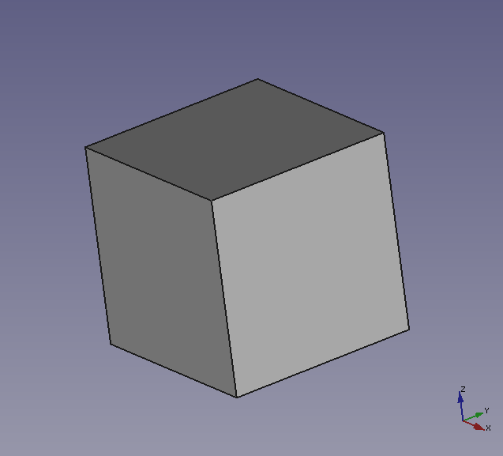

# Understanding the minimum working example


This documents provides an step-by-step explanation of the [minimum working example](./open_cascade_minimum_working_example.md) that may be useful for OpenCascade newcomers.
We assume that we have already created the CMake project (and the corresponding `CMakeLists.txt` file) and now we want to write a small C++ program tocreate a 1x1x1 cube using using OpenCascade.
To do this we will define a square base in the xy-plane and then extrude it in the z-direction to generate the cube.
The first step is to load the libraries used in our project, including (of course) the necessary OpenCascade headers:


```cpp
// Include standard C++ libraries
#include <iostream>
#include <sys/stat.h>	// mkdir()
#include <cmath>

// Include OpenCascade libraries
#include <gp_Pnt.hxx>
#include <TopoDS_Edge.hxx>
#include <TopoDS_Wire.hxx>
#include <TopoDS_Face.hxx>
#include <BRepBuilderAPI_MakeEdge.hxx>
#include <BRepBuilderAPI_MakeWire.hxx>
#include <BRepBuilderAPI_MakeFace.hxx>
#include <BRepPrimAPI_MakePrism.hxx>
#include <STEPControl_Writer.hxx>
	
```

We can also use the `std` namespace to make our code less verbose:

```cpp
 // Define namespaces
 using namespace std; 
```

Now we start the `main()` function of our project, which should look something like this:

```cpp	
int main() {

	...
	
	// We will write our code here
	
	...
	
    return 0;
}
```

The first part of the `main()` function is the definition of the four `gp_Pnt` objects that define the corners of the square:

```cpp
// Create the points that define the geometry of the base-square
gp_Pnt myPoint1(0., 0., 0.);   // Bottom left
gp_Pnt myPoint2(1., 0., 0.);   // Bottom right
gp_Pnt myPoint3(1., 1., 0.);   // Top right
gp_Pnt myPoint4(0., 1., 0.);   // Bottom left
```

Now we can create edges (topological entities) connecting the points using the `BRepBuilderAPI_MakeEdge()` class:

```cpp
// Create the edges using gp_Pnt objects and BRepBuilderAPI_MakeEdge()
TopoDS_Edge myEdge1 = BRepBuilderAPI_MakeEdge(myPoint1, myPoint2);
TopoDS_Edge myEdge2 = BRepBuilderAPI_MakeEdge(myPoint2, myPoint3);
TopoDS_Edge myEdge3 = BRepBuilderAPI_MakeEdge(myPoint3, myPoint4);
TopoDS_Edge myEdge4 = BRepBuilderAPI_MakeEdge(myPoint4, myPoint1);
```

Now we can create the face of the square using the proper OpenCascade API's, note that in order to create the face we need to create a wire first:

```cpp
// Create a closed wire giving the edges to the constructor
TopoDS_Wire myWire = BRepBuilderAPI_MakeWire(myEdge1, myEdge2, myEdge3, myEdge4);

// Make a face from the plane wire
TopoDS_Face myFace = BRepBuilderAPI_MakeFace(myWire);
```

To finish the creation of the cube we extrude the xy-plane square in the z-direction by providing the `TopoDS_Face` and  `gp_Vec` objects to the `BRepPrimAPI_MakePrism()` constructor:

```cpp
// Make a prism sweeping the base-square
gp_Vec sweep_direction(0.00, 0.00, 1.00);
TopoDS_Shape myPrism = BRepPrimAPI_MakePrism(myFace, sweep_direction);
```

Now that we created our OpenCascade model we can export it as a .step file that can be read by any CAD system worth its salt.


```cpp
// Set the destination path and the name of the .step file
string relative_path = "../output/";
string file_name = "minimum_working_example";

// Write the .step file
write_step_file(relative_path, file_name, myPrism);
```


To do this we use the `write_step_file()` function given in the code snippet below. Note that this function should be defined before the `main()` function.


```cpp
IFSelect_ReturnStatus write_step_file(const string &relative_path, const string &model_name, const TopoDS_Shape &model_object) {

// Create the .step writer object
STEPControl_Writer step_writer;

// Set the type of .step representation
STEPControl_StepModelType step_mode = STEPControl_StepModelType::STEPControl_AsIs;

// Create the output directory if it does not exist
mkdir(relative_path.c_str(), 0777);     // 0007 is used to give the user permissions to read+write+execute

// Get the full path to the step file as a C-string
string temp = (relative_path + model_name + ".step");
Standard_CString file_name = temp.c_str();

// Write the .step file
step_writer.Transfer(model_object, step_mode);
IFSelect_ReturnStatus status = step_writer.Write(file_name);
return status;

}

```


We can finish our program loading the exported .step file into a graphical user interface (GUI) to visualize the OpenCascade model. In this example we use the FreeCAD GUI to visualize our model

```cpp	
int main() {

...

// Command to open a new .step model in an existing FreeCAD instance
string open_gui = "freecad --single-instance " + relative_path + file_name + ".step";

// Invoke the operating system command from the C++ program
system(open_gui.c_str());

return 0;

}
```


In case you do not have [FreeCAD](https://www.freecadweb.org/) installed you can do so by typing the [command below](https://www.freecadweb.org/wiki/Install_on_Unix) on your terminal:

	sudo apt-get install freecad
	
	
	
If the installation was successful you should be able to compile the C++ program and visualize the OpenCascade model in the FreeCAD GUI.

 
	
	


